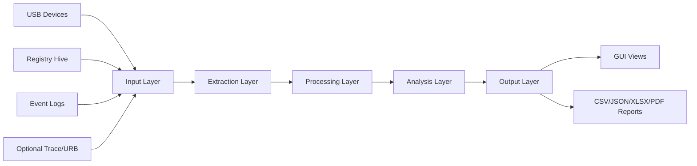

# System Architecture

## 6.1 Overall Architecture Diagram

## 6.2 Input Layer

The input layer is responsible for accepting all raw forensic evidence sources used by the platform.

Primary inputs:
- Live USB/PnP device metadata from the endpoint
- Registry artifacts from USB-related keys
- Event log entries related to USB connect/disconnect activity

Optional inputs:
- Saved USB packet captures (via tshark/Wireshark workflow)
- ETW/URB trace files for low-level transfer analysis

This separation allows analysts to run quick host-level investigations or deeper communication-level analysis when available.

## 6.3 Extraction Layer

The extraction layer performs source-specific acquisition and initial parsing. Each source is handled by a dedicated module to isolate platform dependencies and error handling.

Extraction responsibilities:
- Discover devices and normalize identifiers (VID, PID, serial candidates)
- Parse registry structures into USB-focused entry objects
- Parse event logs into timestamped event records
- Parse optional trace files into packet/transfer records

Fallback behavior is implemented here to keep the tool operational if a source is inaccessible.

## 6.4 Processing Layer

The processing layer normalizes heterogeneous source outputs into consistent intermediate structures. It resolves naming differences, missing fields, and identifier format variation.

Core processing activities:
- Field normalization (timestamps, IDs, source labels)
- Deduplication and record merging
- Preliminary grouping by device identity features
- Data preparation for correlation and analysis

## 6.5 Analysis Layer

The analysis layer transforms normalized evidence into investigation insights.

Key analytical outputs:
- Device activity timelines
- Suspicious pattern tags
- Numeric anomaly scores
- Storage/folder/deleted-file enrichment (when available)
- Optional USB communication behavior summaries

The design favors explainable heuristics over opaque classification, making findings easier to justify in formal reports.

## 6.6 Output Layer

The output layer presents findings in analyst-facing and machine-readable forms.

Output channels:
- GUI pages (devices, analysis, timeline, export, security)
- CSV for tabular reporting
- JSON/detailed JSON for structured evidence exchange
- XLSX for spreadsheet workflows
- PDF for narrative summary and sharing

## 6.7 Data Flow Description

Data flows sequentially from acquisition to extraction, normalization, correlation, analysis, and final export. Correlation acts as the architectural bridge between raw artifacts and investigator conclusions.

High-level flow:
1. Collect source artifacts.
2. Parse source-specific records.
3. Normalize and deduplicate fields.
4. Correlate entries into per-device timelines.
5. Compute analytical metrics and suspicious indicators.
6. Render GUI views and generate report files.

Because each layer is modular, updates can be made to individual components (for example, parser improvements) without redesigning the entire pipeline.

### Architectural Quality Attributes

The architecture is designed to satisfy the following quality attributes:
- Maintainability: module boundaries reduce regression risk during enhancements.
- Observability: structured logs make execution behavior easier to trace.
- Extensibility: optional modules can be integrated with limited core disruption.
- Usability: GUI and export layers convert technical artifacts into analyst-ready views.
- Resilience: fallback paths preserve operational continuity in constrained environments.

### Layer Interaction Detail

Input and extraction layers are intentionally source-centric. They translate platform-specific evidence into neutral structures. Processing and correlation layers are identity-centric, focusing on mapping, deduplication, and chronology. Analysis and output layers are consumer-centric, focusing on interpretation and communication.

This layered progression avoids tightly coupling collection logic to report formatting logic. As a result, report schema evolution can occur independently of parser internals.

### Error Handling and Fallback Design

The architecture treats source failures as expected runtime conditions rather than exceptional fatal states. For example:
- Missing privileged access returns reduced dataset paths.
- Missing optional libraries disable only dependent features.
- Parser-level exceptions are logged and isolated where possible.

This strategy is especially important in endpoint investigations where tooling must remain useful even with incomplete access.

### Security and Integrity Considerations

Although this project is not a full evidence-chain platform, architecture decisions support integrity-oriented practices:
- Structured outputs reduce manual data copying errors.
- Dated export artifacts improve traceability.
- Modular separation supports independent validation of source parsing and scoring logic.

Future chain-of-custody enhancements can be integrated on top of this architecture without redesigning core module flow.
